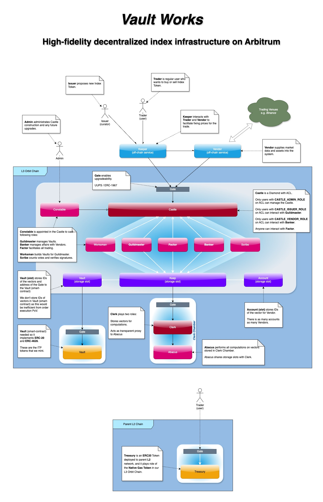

# VaultWorks

### High-fidelity decentralized engine for the synthesis and settlement of institutional-grade financial indices on Arbitrum.

**VaultWorks** provides a strong core for the next generation of asset management. By replacing legacy financial intermediation with a system of deterministic mathematical laws, we enable the creation and settlement of indices with absolute precision and cryptographic sovereignty.

Powered by *Arbitrum Stylus (Rust)*, VaultWorks achieves ***near-native performance***, allowing ***complex vector-based financial products*** to operate at the speed and scale required by global capital markets.

---

## 🏰 The Architecture of the Castle

The ecosystem is structured as a **Castle**—a high-integrity environment—where the protocol itself autonomously guards the ***Access Control List (ACL)*** and secures the perimeter against unauthorized execution.

### The Inhabitants of the Castle

| **Role** | **Focus** | **Function** |
| --- | --- | --- |
| **Factor** | Trading Strategy | Manages pricing and facilitates asset trading for Index orders. |
| **Banker** | Inventory Management | Oversees asset inventory and enforces operational limits. |
| **Guildmaster** | Issuance & Governance | Manages Index creation and commands the Worksman to deploy Vaults. |
| **Constable** | Functions & Security | Architects protocol functions and assigns sovereign roles to them. |
| **Scribe** | Signature Verification | Verifies cryptographic signatures and tallies governance votes. |
| **Worksman** | Vault Construction | Constructs and deploys sovereign Vaults. |

---

## 📜 The Core: Clerk and Abacus

**VaultWorks** separates computational execution from top-level business logic to ensure a disciplined financial state.

* **The Vaults:** They implement ***ERC-20*** and ***ERC-7540 / ERC-4626***. High-security attachments that house ***Index definitions***, asset weights, and user orders. They are built by the Worksman on command of the Guildmaster.
* **The Gate:** An implementation of the ***Proxy (ERC-1967)*** pattern providing secure, structured access points. The architecture utilizes a primary gate to the Castle, a dedicated Gate to the **Clerk**—the interface where the crew interacts to execute orders and access liquidity—and individual Gates for each **Vault** attachment.
* **The Clerk:** An implementation of the ***UUPS (ERC-1822)*** pattern; the Clerk executes deterministic mathematical formulas on the Abacus and records the final state in stored vectors.
* **The Abacus:** The computational engine that performs ***high-velocity, zero-copy mathematics***, bypassing the gas overhead of standard EVM implementations. Also known as the ***VIL VM: Decentralized Vector Intermediate Language Virtual Machine***.

**White Papers** are included.

- [Technical Brief - Systematic Risk Controls And Execution Framework](/docs/Technical%20Brief%20-%20Systematic%20Risk%20Controls%20And%20Execution%20Framework.pdf)

- [Gas-Efficient Vector Processing for On-Chain Index Order Execution](/docs/Gas-Efficient%20Vector%20Processing%20for%20On-Chain%20Index%20Order%20Execution.pdf)

- [VIL VM Technical Specification](/docs/VIL%20VM%20Technical%20Specification.pdf)

- [Aligning Market and Index Vectors](/docs/Aligning%20Market%20and%20Index%20Vectors.pdf)

---

## ⚡ Designed For Performance

**VaultWorks** is engineered for the highest standards of accuracy, transparency, and efficiency.

1. **Speed & Precision:** Data is represented as ***vectors of 128-bit decimals with 256-bit computational precision***, ensuring exacting accuracy while maintaining WASM binaries under the 24KiB limit.
2. **Gas Efficiency:** By utilizing a custom-built VIL VM, we eliminate the overhead of standard blockchain `SLOAD`/`SSTORE` operations, ensuring the ***core remains strong under high-frequency load***.
3. **Financial Accuracy:** Trading is driven by maximizing available margin (reducing liability through incremental pegging) using the math of equity, assets, and liability, represented here as ***Supply***, ***Demand***, and ***Delta*** vectors.

---

## 🏁 Developer Guide

To **start building** with us and read **[more here](DEVELOPER.md)**.

Read [more here](/libs/abacus-runtime/README.md) to learn about *Vector Intermediate Language Virtual Machine (VIL VM)*.
