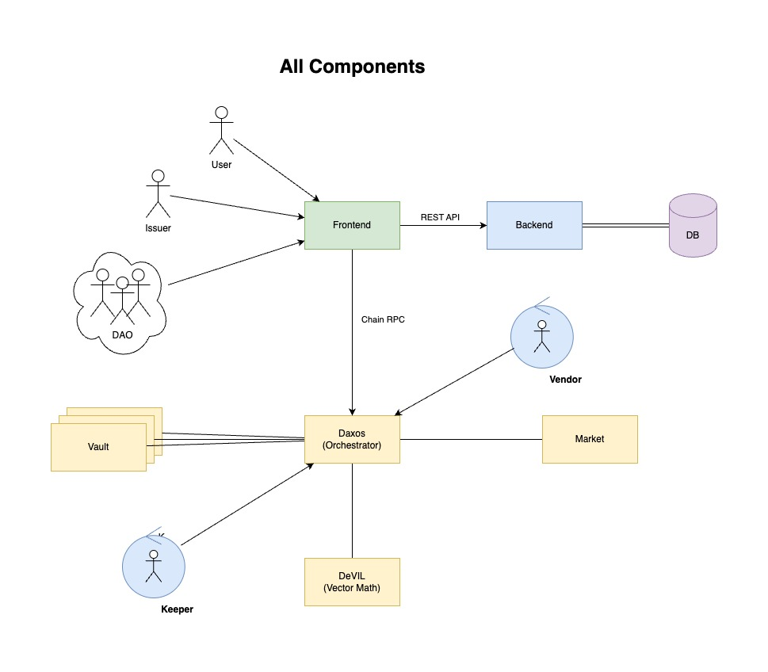
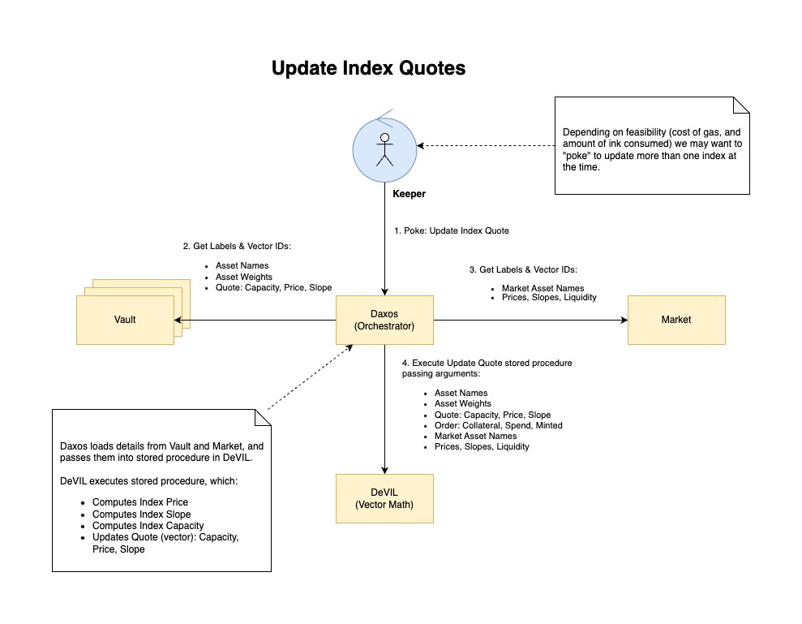

# Decentralised Index Maker

## About

This is ***Decentralised Index Maker (DeIndex)*** project.

*Daxos is a demigod from Theros. Here he's our hero, who goes to Market to meet
wih the Vendor, to buy and sell items. Then he goes on a journey to explore the
tresure hidden in the Vaults. On his way he deals with Devil, to whom he
delegates the hardest tasks.*

*DAX* is a well known Index listed on Frankfurt Stock Exchange. *DAX-os* is a
play of words. *Daxos* is also a demigod in *Magic The Gathering* card game.

In our decentralised architecture where *Vault* is smart-contract representing
an Index, and *DeVIL* being acronym for *Decentralised Vector Intermediate
Language*, we needed a hero that will go to that *Devil*. We also needed to
express *Supply - Demand* relationship, and give a suitable name to *Authorised
Provider* a.k.a. *AP*. Falling into RPG theme, a bit of Diablo like, we have
chosen to use name *Vendor* for *AP*. Like in Diablo, hero needs to meet a
vendor on the market, and what is the better name for smart-contract storing
*Supply & Demand* if not *Market*. Thus in our very simple design we have:
*Vaults, Market, Devil & Daxos*, and off-chain service we called *Vendor*.


## Architecture



### **On-Chain Components:**

- *Vault*     - Represents ITP Token, implements *ERC20*, and stores: asset weights, prices, and user's orders.
- *Market*   - Stores asset market data, and market state, i.e. supply, demand and delta.
- *Daxos*     - Orchestrates all business logic. Goes to *Market* to create *Demand*.
- *DeVIL*     - Executes Vector Math programs such as: order execution, quote update, supply update.

### **Off-Chain Components**

- *Frontend*       - Connects user wallet, and provides user interface to buy/sell ITP Index.
- *Backend*        - Manages and stores database of ITP Indexes and provides additional metrics.
- *Vendor*         - Authorized Provider supplying assets from CEX / DEX. Goes to *Market* to create *Supply*.
- *Relayer*        - RPC Relayer for collateral routing.
- *Quoter*         - Poking bot for updating Index prices.

All of the above off-chain components interact exclusively with *Daxos*
contract, except *Vault* contracts can be interacted via *IERC20* interface,
i.e. as ITP tokens.

### **Interaction**

#### Create Index & Initial Quote

Here *Issuer* wants to add new index to the system.


#### New Order: Instant Fill

Here *User* places new order, which gets instantly filled, and
and ITP Index token is minted by *Vault*.


#### Update Index Quotes

Here external service sends a *Poke* to update index quotes, i.e. prices and capacity
so that they are used the next time instant fill is processed.



#### Submit Inventory

Here *Vendor* service adds new *Inventory* to the pool.


## Summary

This design delegates all vector math computation to Vector IL virtual machine, which is critical
for achieving high performance zero-copy, minimum blockchain load/store overhead, and yet plenty
of WASM space for implementing business logic in the client contracts, i.e. *Vault*, *Market*, and
*Daxos*.

### Smart-Contracts


## Development

The development process is simple, but requires meticulous approach as the
integration of the **off-chain** code with **on-chain** smart-contracts needed
to setup workspace is this specific manner.

### **Scripts:** Build, Test & Deploy Smart-Contracts

There are scripts provided in `./scripts` directory to manage Stylus contracts.
These scripts are necessary as we were unable to use Stylus with Cargo Workspace
correctly. Using these scripts we can build both Stylus contracts and off-chain
Access Point (AP) robot, which can share librares such as `deli` (Decentralised
Utility Lib). We set-up `deli` in such a way that it builds with `no_std` for
linking with Stylus smart-contracts, and with `std` otherwise. Sharing `deli`
with off-chain code is critical to ensure that binary blob serialization is
consistent between smart-contracts and off-chain code. We developed absolutely
minimal serialisation, which supports only decimal and vector data types. We
provded our own 128-bit decimal data type, as we have found that rust_decimal
takes up more space in wasm. We tested bincode and serde both json and rmp, and
they were bloating wasm size way beyond 24kB limit. To keep wasm size tiny we
implemented minimalistic `delib` utility library. We use binary blobs containing
vectors of decimals as inspired by such libraries as OpenGL or OpenAL. With this
approach we keep structure of blobs simple, and we minimise the amount of code
required to handle blobs. Any array data would be passed as such blobs storing
vectors of decimals as a default mechanism.

### Setup Steps

**NOTE** For best results it is best to follow these steps in this concrete sequence, as otherwise things may not work!

**IMPORTANT** DO NOT USE ~~`cargo update`~~ as this will definitely break tests.

#### 1. Run Tests

Build & run tests by using standard:
```
cargo test
```

Alternatively build tests for specific contract with debug logging:
```
./scripts/test-debug.sh CONTRACT_NAME
```

Example:
```
./scripts/test-debug.sh disolver
```

#### 2. Launch Arbitrum Nitro Node

Firt clone Nitro Development Node repository:
```bash
git clone https://github.com/OffchainLabs/nitro-devnode.git
```

And then launch:
```bash
./run-dev-node.sh
```

#### 3. Build Contracts

Build each contract by using scripts provided:
```
./scripts/check.sh CONTRACT_NAME
```

Example:
```
./scripts/check.sh disolver
```

#### 5. Deploy Contracts

Deploy contracts each contract by using scripts provided:
```
./scripts/deploy.sh CONTRACT_NAME
```

Example:
```
./scripts/deploy.sh disolver
```

#### 6. Export Contracts ABI

Export contracts ABI each contract by using scripts provided:
```
./scripts/export-abi.sh CONTRACT_NAME
```

Example:
```
./scripts/export-abi.sh disolver
```
